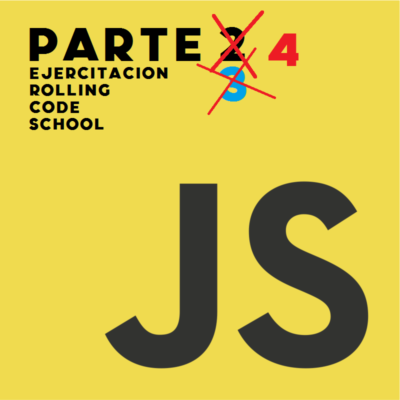

# Proyecto **Javascript** Rolling Code 

En este repositorio encontraran la practica hecha con Javascript del curso de **Rolling Code School** correspondiente a la **Cuarta parte practica**. Son libres de ver y clonar el repositorio para aprender junto a nosotros.

>## Integrante del proyecto
- Navarro Leandro [GitHub](https://github.com/NavarroLeandro)

>## Contribuciones
Si deseas contribuir al desarrollo de estos ejercicios, ¡serás bienvenido! Siéntete libre de crear un clone de este repositorio y enviar tus pull requests. Asegúrate de revisar nuestras guías de contribución antes de empezar.

>## Licencia
Este proyecto se distribuye bajo la licencia MIT. Consulta el archivo LICENSE para obtener más información.